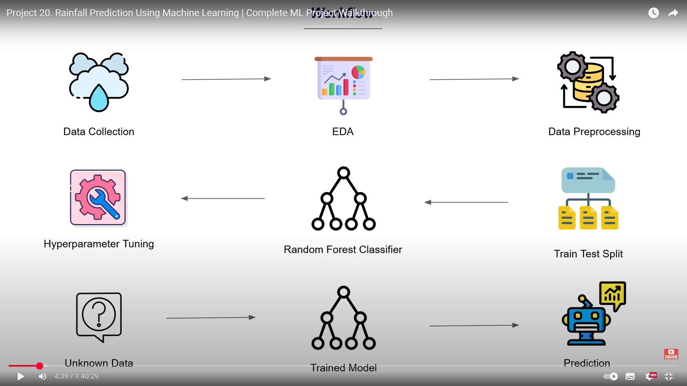

# Rainfall_Prediction_ML
Rainfall_Prediction_ML is a machine learning project that predicts rainfall using historical weather data from Kaggle. It applies a Random Forest Classifier with hyperparameter tuning via GridSearchCV, performing end-to-end steps including EDA, preprocessing, model training, and prediction to achieve accurate rainfall forecasting.


# 🌧️ Rainfall_Prediction_ML

A **Machine Learning project** that predicts whether it will **rain or not** based on weather parameters using the **Random Forest Classifier**. This end-to-end project covers the complete ML pipeline — from data collection to model deployment-ready prediction.

---

## 📊 Project Overview

Rain prediction plays a vital role in agriculture, weather forecasting, and environmental planning. This project leverages **machine learning techniques** to predict rainfall accurately using historical weather data.
The workflow follows standard ML stages such as **data preprocessing, exploratory data analysis (EDA), model building, hyperparameter tuning, and prediction**.

---

## 🧠 Workflow



### Steps Involved:

1. **Data Collection** – Gathered dataset from [Kaggle](https://www.kaggle.com/) containing various meteorological attributes.
2. **EDA (Exploratory Data Analysis)** – Visualized data distributions, correlations, and patterns to understand key influencing factors for rainfall.
3. **Data Preprocessing** – Handled missing values, encoded categorical variables, and scaled numerical features for optimal model performance.
4. **Train-Test Split** – Split data into training and testing sets for model evaluation.
5. **Model Building** – Implemented **Random Forest Classifier** for classification.
6. **Hyperparameter Tuning** – Used **GridSearchCV** for tuning parameters to improve model accuracy and robustness.
   ![Hyperparameter Tuning]
7. **Model Saving** – Serialized the trained model using **pickle** for future use.
8. **Prediction** – Loaded the trained model and tested it on unknown data to make predictions.

---

## ⚙️ Technologies Used

* **Python**
* **Pandas**, **NumPy**, **Matplotlib**, **Seaborn** – Data analysis and visualization
* **Scikit-learn** – Model building and tuning
* **Pickle** – Model serialization
* **Jupyter Notebook / Google Colab** – Experimentation and visualization

---

## 📁 Dataset

The dataset used in this project is taken from [Kaggle](https://www.kaggle.com/), containing multiple meteorological features such as:

* Temperature
* Humidity
* Pressure
* Wind Speed
* Sunshine Hours
* Cloud Cover
* Rainfall Indicator

---

## 📈 Model Performance

* **Algorithm Used:** Random Forest Classifier
* **Evaluation Metric:** Accuracy, Precision, Recall, F1-Score
* **Optimization:** GridSearchCV for hyperparameter tuning

---

## 🚀 How to Run

1. Clone the repository:

   ```bash
   git clone https://github.com/sumitraj02/Rainfall_Prediction_ML.git
   cd Rainfall_Prediction_ML
   ```

2. Install dependencies:

   ```bash
   pip install -r requirements.txt
   ```

3. Run the Jupyter notebook or Python file:

   ```bash
   jupyter notebook
   ```

   or

   ```bash
   python rainfall_prediction.py
   ```

4. Load the trained model and make predictions using the sample input.

---

## 🔮 Sample Prediction

Example input:

```python
input_data = (1015.9, 19.9, 95, 81, 0.0, 40.0, 13.7)
```

Output:

```
Prediction result: Rainfall
```

---

## 🧾 Future Improvements

* Deploy model using **Flask or FastAPI** for web-based interaction
* Integrate real-time weather APIs for live predictions
* Experiment with **deep learning models** (LSTM/GRU) for time-series forecasting

---

## ✨ Author

**Sumit Kumar**
🎓 Student at GLBITM | 💻 ML & Full Stack Developer
🔗 [LinkedIn](https://www.linkedin.com/in/sumit-kumar-70a6a1259/) • [GitHub](https://github.com/sumitraj02)

---

⭐ If you like this project, don't forget to **star** the repository!
